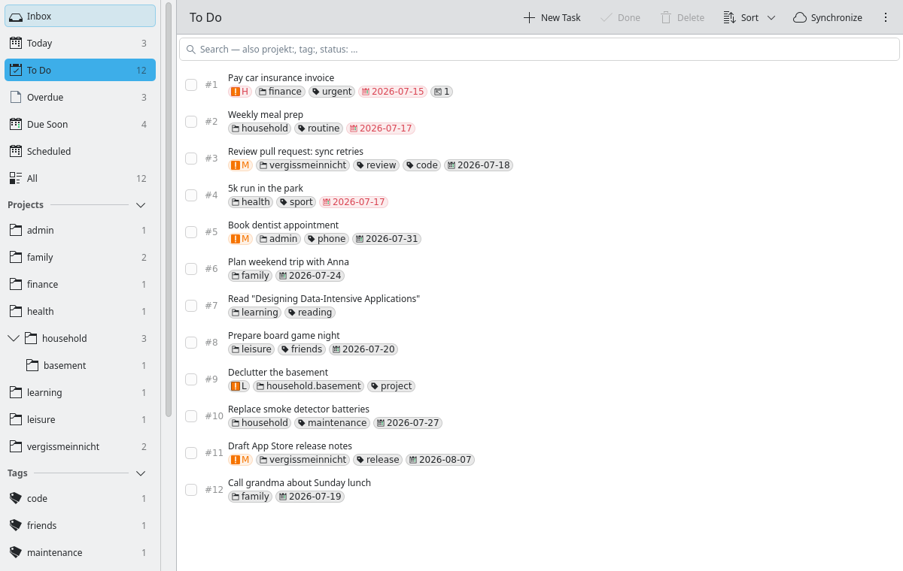

# Vergissmeinnicht (KDE)

[](https://github.com/hnsstrk/vergissmeinnicht-kde/actions/workflows/ci.yml)
[](https://github.com/hnsstrk/vergissmeinnicht-kde/releases/latest)
[](LICENSE)

Ein nativer KDE-Plasma-Client für [Taskwarrior](https://taskwarrior.org) 3.x
auf Basis von [TaskChampion](https://github.com/GothenburgBitFactory/taskchampion).
Kirigami-Oberfläche, Rust-Kern via [cxx-qt](https://github.com/KDAB/cxx-qt).

Dies ist der Linux/KDE-Port der
[gleichnamigen macOS-App](https://github.com/hnsstrk/vergissmeinnicht) —
derselbe Rust-Kern, dieselbe Replica-plus-Sync-Architektur, native
Oberfläche auf jeder Plattform.

🇬🇧 [English version](README.md)



## Funktionen

- **Seitenleisten-Perspektiven** — Eingang · Heute · Zu erledigen · Überfällig ·
  Bald fällig · Geplant · Wartend · Alle, dazu Projekt- und Tag-Zeilen mit
  Live-Zählern, Drop-Zielen und Kontextmenüs (Umbenennen/Entfernen).
  Gepunktete Projekte (`Arbeit.Teilprojekt`) bilden einen klappbaren Baum;
  die Auswahl eines Elternprojekts schließt Subprojekte ein
  (Taskwarrior-Präfix-Semantik). Die Breite lässt sich per Zieh-Griff
  anpassen, Sektionen klappen per Klick auf ihre Überschrift ein und aus;
  beides bleibt gespeichert.
- **Volltextsuche mit Operatoren** (Strg+F) — durchsucht Titel, Projekt, Tags
  und Notizen über den gesamten Bestand (offen, erledigt, wiederkehrend).
  UND-Verknüpfung, Phrasen in Anführungszeichen sowie `projekt:`, `tag:`,
  `status:` (deutsche und englische Aliase). Bei aktiver Suche wird der
  Seitenleisten-Filter ignoriert.
- **Gespeicherte Suchen** (Strg+Umschalt+D) — Suche benennen und in der
  Seitenleiste anheften. Rechtsklick zum Umbenennen oder Löschen.
- **Schnelleingabe** (Strg+N) — Fenster mit Titel, Notizen, Projekt, Tags,
  Fälligkeit, Priorität, Wiederholung. Das Titelfeld versteht
  Terminal-Syntax (`+tag project:foo due:tomorrow priority:H`) mit
  Live-Vorschau. Wie Detail-Editor und Einstellungen öffnet sie sich als
  eigenständiges Dialogfenster (frei beweg- und skalierbar), nicht als
  Modal im Hauptfenster.
- **Detail-Editor** — Titel, Projekt, Tags, Fällig, Geplant ab, Warten bis,
  Priorität, Wiederholung, Notizen, Abhängigkeits-Editor, Reaktivieren
  erledigter Aufgaben.
- **Mehrfachauswahl** mit Sammel-Aktionen (Erledigt / Löschen / Projekt /
  Tag / Priorität / Fälligkeit / Zurückstellen) über das Kontextmenü
  (Strg/Umschalt+Klick, Strg+A).
- **Drag & Drop** von Aufgaben auf Projekte, Tags oder den Eingang
  (entfernt Projekt + Tags).
- **Wiederkehrende Aufgaben** — täglich / wöchentlich / monatlich / jährlich
  sowie `Nd / Nw / Nm / Ny`. Das Erledigen erzeugt atomar die Folge-Instanz.
- **Zurückstellen (Snooze)** — verschobene Aufgaben erscheinen unter
  „Wartend“ statt „Heute“ zu verstopfen.
- **Abhängigkeiten** — Berichte Blockiert / Blockierend / Nicht blockiert
  (`+BLOCKED`/`+BLOCKING`/`+UNBLOCKED`-Semantik) plus Abhängigkeits-Editor im
  Detail-Dialog (`depends`-Relationen hinzufügen/entfernen, mit Titel-Auflösung).
- **Benachrichtigungen** — Opt-in-Zusammenfassung beim Start, wenn
  überfällige Aufgaben vorliegen.
- **Lokalisierung** — Deutsch (Quellsprache) und Englisch über
  ki18n/gettext, mit manueller Umschaltung in den Einstellungen.
- **Synchronisierung** gegen einen beliebigen
  [taskchampion-sync-server](https://github.com/GothenburgBitFactory/taskchampion-sync-server).
  Zugangsdaten liegen im Secret Service des Systems (KWallet).
  Auto-Sync: manuell, alle 5/15/60 Minuten oder sofort nach Änderungen.
  Der Werkzeugleisten-Knopf zeigt unsynchronisierte lokale Änderungen mit
  einem blauen Punkt an.
- **Automatische Backups** — `VACUUM INTO`-Snapshot vor jedem Sync,
  rotierend die letzten 10. Manuelles Backup und Wiederherstellung in den
  Einstellungen. Siehe [`docs/backup-and-restore.md`](docs/backup-and-restore.md).
- **Legacy-Reparatur** — eine Wartungsaktion überführt Token-Syntax in
  Aufgabentiteln (`+tag project:x`) in echte Eigenschaften.

*(Alle Screenshots zeigen einen deterministischen Demo-Datensatz —
`cargo run --release -p vergissmeinnicht-core --example seed_demo -- <replica-pfad>`.)*

## Architektur

```
┌─────────────────────────────────────────────┐
│  Kirigami/QML-UI (Hauptfenster + Dialoge)   │
│  Sidebar · Taskliste · Detail · Settings    │
└──────────────────┬──────────────────────────┘
                   │  cxx-qt-Bridge (QAbstractListModel + Invokables)
┌──────────────────▼──────────────────────────┐
│  vergissmeinnicht-app (Rust)                │
│  AppState · Filter · Parser · Backups       │
└──────────────────┬──────────────────────────┘
                   │  reines Rust
┌──────────────────▼──────────────────────────┐
│  vergissmeinnicht-core (Rust)               │
│  taskchampion 3.x · tokio                   │
│  Replica = SQLite im XDG-Datenverzeichnis   │
└──────────────────┬──────────────────────────┘
                   │  HTTPS
┌──────────────────▼──────────────────────────┐
│  taskchampion-sync-server (selbst betrieben)│
└─────────────────────────────────────────────┘
```

Die Replica liegt unter `~/.local/share/vergissmeinnicht/replica/`. Die App
fasst das Datenverzeichnis der Taskwarrior-CLI **nicht** an — beide sind
unabhängige TaskChampion-Replicas, die über denselben Sync-Server
konvergieren; genau wie die macOS-App und die CLI auf anderen Rechnern.

Design-Begründungen (Speicher-Layout, `u32`-Working-Set-ID, Replica-Lebenszyklus):
[`docs/architecture.md`](docs/architecture.md).

## Download

Release-Tarballs (dynamisch gelinktes x86_64, gebaut auf Arch Linux) liegen
auf der [Releases-Seite](https://github.com/hnsstrk/vergissmeinnicht-kde/releases).
Zur Laufzeit werden Qt 6, Kirigami 6, Kirigami Addons, ki18n und
qqc2-desktop-style benötigt. Außerhalb aktueller Rolling-Release-Distributionen
ist der **Build aus den Quellen der empfohlene Weg** — siehe unten.

## Voraussetzungen

- Qt 6 (qt6-base, qt6-declarative)
- KDE Frameworks 6: Kirigami, Kirigami Addons, ki18n, qqc2-desktop-style,
  Breeze-Icons
- Rust-Toolchain (stable)
- gettext (`msgfmt`, für die Übersetzungskataloge)

Auf Arch und Derivaten:

```sh
pacman -S --needed rust qt6-base qt6-declarative kirigami kirigami-addons \
    ki18n qqc2-desktop-style breeze-icons gettext
```

## Bauen

```sh
# Debug-Build bauen und starten
cargo build
./target/debug/vergissmeinnicht

# Oder bauen + nach ~/.local installieren (Binary, Desktop-Datei, Icon, Übersetzungen)
scripts/install-local.sh
```

Testsuite:

```sh
cargo test --workspace
```

Details (Toolchain, QML-/Bridge-Registrierung, Headless-Testhaken
`--test-flow`/`--test-grab`): [`docs/building.md`](docs/building.md).

## Sync einrichten

1. Eigenen [taskchampion-sync-server](https://github.com/GothenburgBitFactory/taskchampion-sync-server)
   betreiben (oder einen bestehenden nutzen).
2. In der App **Einstellungen → Synchronisation** öffnen und URL, Client-ID
   und Encryption-Secret eintragen. Sie landen im Secret Service
   (unter Plasma: KWallet).
3. **Speichern und Sync testen** klicken. Fertig.

App und `task`-CLI auf anderen Rechnern gleichen sich über den Sync-Server
ab. TaskChampion löst Konflikte CRDT-artig über sein Operation-Log.

## Repo-Aufbau

```
.
├── core/               Rust-Kern: taskchampion-Wrapper (TaskStore, TaskInfo)
│   └── examples/       seed_demo, sync_roundtrip (E2E gegen laufenden Server)
├── app/                Kirigami-App
│   ├── src/            cxx-qt-Bridge, Filter, Parser, State, Backups
│   ├── qml/            Hauptfenster, Seitenleiste, Dialoge
│   └── cpp/            kleine Shims (KLocalizedContext, Fenster-Grab)
├── data/               Desktop-Datei, Icon, AppStream-Metainfo
├── po/                 gettext-Vorlage + englischer Katalog
├── scripts/            install-local.sh
└── docs/               Architektur, Build, Backup & Restore
```

## Hooks: bewusst nicht im Scope

Taskwarrior-Hooks sind ein Feature der `task`-CLI, nicht der
TaskChampion-Bibliothek. Entsprechende Funktionen (Erinnerungen, Validierung)
sind nativ umgesetzt — dieselbe Entscheidung wie in der macOS-App.

## Danksagungen

- [Taskwarrior](https://taskwarrior.org) und das GothenburgBitFactory-Team für
  [TaskChampion](https://github.com/GothenburgBitFactory/taskchampion) und den
  Sync-Server.
- [KDAB](https://www.kdab.com) für [cxx-qt](https://github.com/KDAB/cxx-qt).
- Die KDE-Community für Kirigami und die Frameworks.

## Lizenz

[MIT](LICENSE).
