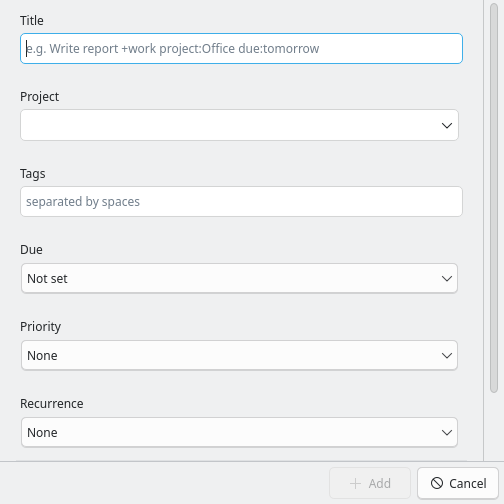
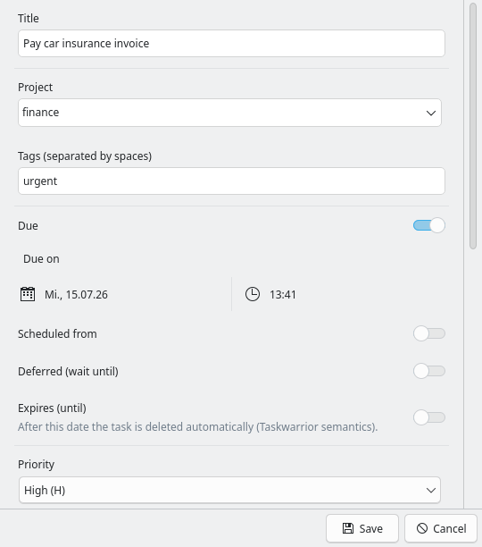

# Vergissmeinnicht (KDE)

[](https://github.com/hnsstrk/vergissmeinnicht-kde/actions/workflows/ci.yml)
[](https://github.com/hnsstrk/vergissmeinnicht-kde/releases/latest)
[](LICENSE)

A native KDE Plasma client for [Taskwarrior](https://taskwarrior.org) 3.x,
built on [TaskChampion](https://github.com/GothenburgBitFactory/taskchampion).
Kirigami front-end, Rust core via [cxx-qt](https://github.com/KDAB/cxx-qt).

This is the Linux/KDE port of the
[macOS app of the same name](https://github.com/hnsstrk/vergissmeinnicht) —
same Rust core, same replica-plus-sync architecture, native UI on each
platform.

> **Vergissmeinnicht** is the German word for *forget-me-not* — a flower, and
> a reminder.

🇩🇪 [Deutsche Version](README.de.md)


## Features

- **Sidebar perspectives** — Inbox · Today · To Do · Overdue · Due Soon ·
  Scheduled · Waiting · All, plus per-project and per-tag rows. Live counts,
  drop targets, context menus for rename/remove. Dotted projects
  (`Work.Sub`) form a collapsible tree; selecting a parent includes its
  subprojects (Taskwarrior prefix semantics). Resizable via a drag handle,
  sections collapse by clicking their headers; both are persisted.
- **Full-text search with operators** (Ctrl+F) — covers title, project, tags,
  and annotations across the entire store (pending, completed, recurring).
  Supports AND terms, quoted phrases, and `project:`, `tag:`, `status:`
  operators (German and English aliases). While a search is active the
  sidebar filter is ignored.
- **Saved searches** (Ctrl+Shift+D) — name a search and pin it to the sidebar
  between system filters and projects. Right-click to rename or delete.
- **Quick capture** (Ctrl+N) — capture window with title, notes, project,
  tags, due, priority, recurrence. The title field understands terminal-style
  tokens (`+tag project:foo due:tomorrow priority:H`) with a live preview.
  Like the detail editor and the settings, it opens as a separate dialog
  window (movable and resizable), not as a modal inside the main window.

  
- **Detail editor** — title, project, tags, due, scheduled, wait, priority,
  recurrence, annotations, dependency editor, reactivate for completed
  tasks.

  
- **Multi-selection** with bulk done / delete / project / tag / priority /
  due / snooze via context menu (Ctrl/Shift+click, Ctrl+A).
- **Drag & drop** tasks onto projects, tags, or Inbox (clears project + tags).
- **Recurring tasks** — daily / weekly / monthly / yearly + `Nd / Nw / Nm /
  Ny`. Completing a recurring task atomically creates the next instance.
- **Snooze / wait** — defer tasks; they appear under "Waiting" instead of
  cluttering Today.
- **Dependencies** — Blocked / Blocking / Unblocked report views
  (`+BLOCKED`/`+BLOCKING`/`+UNBLOCKED` semantics) plus a dependency editor in
  the detail dialog (add/remove `depends` relations with title lookup).
- **Notifications** — opt-in summary at launch when overdue tasks exist
  (freedesktop notifications).
- **Localization** — German (source) and English via ki18n/gettext, with
  manual override in the settings.
- **Sync** against any [taskchampion-sync-server](https://github.com/GothenburgBitFactory/taskchampion-sync-server)
  you point it at. Credentials live in the system Secret Service (KWallet).
  Auto-sync modes: manual, every 5/15/60 minutes, or immediately after
  changes. The toolbar button indicates unsynchronized local changes with
  a blue dot.
- **Automatic backups** — `VACUUM INTO` snapshot before every sync, rotated
  to the last 10. Manual backup and restore from settings. See
  [`docs/backup-and-restore.md`](docs/backup-and-restore.md).
- **Taskwarrior parity** — urgency (exact CLI formula) as sort order,
  start/stop (active task), undo (Ctrl+Z), `until` expiry, duplicate,
  JSON export incl. UDAs, virtual tags and `due.before:`/`due.after:`/
  `project.not:` in search, CLI date synonyms (`eow`, `friday`, `23rd`, …)
  and recur synonyms (`weekdays`, `quarterly`, …). CLI recurrence
  templates are respected, never duplicated — coexistence with the
  `task` CLI on a shared sync server is verified end-to-end
  (see `docs/architecture.md`).
- **Legacy repair** — a maintenance action converts token syntax left in
  task titles (`+tag project:x`) into real properties.

*(All screenshots show a seeded demo dataset —
`cargo run --release -p vergissmeinnicht-core --example seed_demo -- <replica-path>`.)*

## Architecture

```
┌─────────────────────────────────────────────┐
│  Kirigami/QML UI (Main window + dialogs)    │
│  Sidebar · TaskList · Detail · Settings     │
└──────────────────┬──────────────────────────┘
                   │  cxx-qt bridge (QAbstractListModel + invokables)
┌──────────────────▼──────────────────────────┐
│  vergissmeinnicht-app (Rust)                │
│  AppState · filters · parsers · backups     │
└──────────────────┬──────────────────────────┘
                   │  plain Rust
┌──────────────────▼──────────────────────────┐
│  vergissmeinnicht-core (Rust)               │
│  taskchampion 3.x · tokio                   │
│  Replica = SQLite under XDG data dir        │
└──────────────────┬──────────────────────────┘
                   │  HTTPS
┌──────────────────▼──────────────────────────┐
│  taskchampion-sync-server (your own)        │
└─────────────────────────────────────────────┘
```

The replica lives in `~/.local/share/vergissmeinnicht/replica/`. The app does
**not** touch the Taskwarrior CLI's own data directory — both are independent
TaskChampion replicas that converge through the same sync server, exactly like
the macOS app and the CLI on other machines.

See [`docs/architecture.md`](docs/architecture.md) for the design rationale
behind the storage layout, the `u32` working-set ID, and the replica
lifecycle.

## Download

Release tarballs (dynamically linked x86_64, built on Arch Linux) are
available on the [releases page](https://github.com/hnsstrk/vergissmeinnicht-kde/releases).
They require Qt 6, Kirigami 6, Kirigami Addons, ki18n, and
qqc2-desktop-style at runtime. On anything that is not a current rolling
release, **building from source is the recommended path** — see below.

## Requirements

- Qt 6 (qt6-base, qt6-declarative)
- KDE Frameworks 6: Kirigami, Kirigami Addons, ki18n, qqc2-desktop-style,
  Breeze icons
- Rust toolchain (stable)
- gettext (`msgfmt`, for the translation catalogs)

On Arch and derivatives:

```sh
pacman -S --needed rust qt6-base qt6-declarative kirigami kirigami-addons \
    ki18n qqc2-desktop-style breeze-icons gettext
```

## Build

```sh
# Build and run the debug build
cargo build
./target/debug/vergissmeinnicht

# Or build + install to ~/.local (binary, desktop file, icon, translations)
scripts/install-local.sh
```

Run the test suite:

```sh
cargo test --workspace
```

See [`docs/building.md`](docs/building.md) for toolchain notes, the QML/bridge
registration rules, and the headless test hooks (`--test-flow`,
`--test-grab`).

## Sync setup

1. Run your own [taskchampion-sync-server](https://github.com/GothenburgBitFactory/taskchampion-sync-server)
   (or use an existing one).
2. In the app, open **Settings → Synchronization** and fill in URL, client ID,
   and the encryption secret. They are stored in the Secret Service
   (KWallet on Plasma).
3. Click **Save and test sync**. Done.

The app and the `task` CLI on other machines reconcile through the sync
server. TaskChampion resolves conflicts CRDT-style via its operation log.

## Project layout

```
.
├── core/               Rust core: taskchampion wrapper (TaskStore, TaskInfo)
│   └── examples/       seed_demo, sync_roundtrip (E2E against a live server)
├── app/                Kirigami app
│   ├── src/            cxx-qt bridge, filters, parsers, state, backups
│   ├── qml/            Main window, sidebar, dialogs
│   └── cpp/            small shims (KLocalizedContext, window grab)
├── data/               desktop file, icon, AppStream metainfo
├── po/                 gettext template + English catalog
├── scripts/            install-local.sh
└── docs/               architecture notes, building, backup & restore
```

## Hooks: out of scope by design

Taskwarrior hooks are a feature of the `task` CLI, not the TaskChampion
library this app uses. Equivalents (reminders, validation) are implemented
natively — same decision as the macOS app.

## Acknowledgements

- [Taskwarrior](https://taskwarrior.org) and the GothenburgBitFactory team for
  [TaskChampion](https://github.com/GothenburgBitFactory/taskchampion) and the
  sync server.
- [KDAB](https://www.kdab.com) for [cxx-qt](https://github.com/KDAB/cxx-qt).
- The KDE community for Kirigami and the Frameworks.

## License

[MIT](LICENSE).
