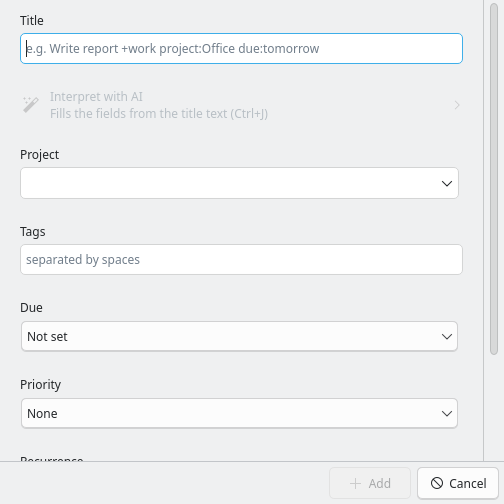
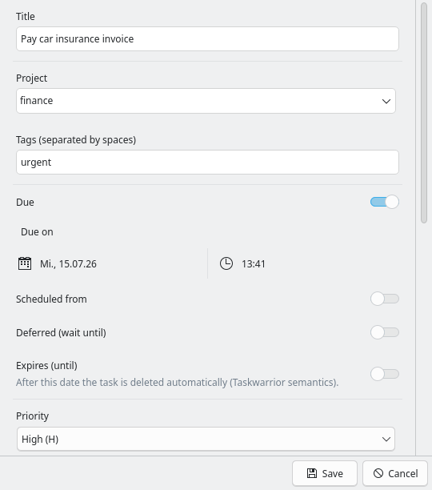
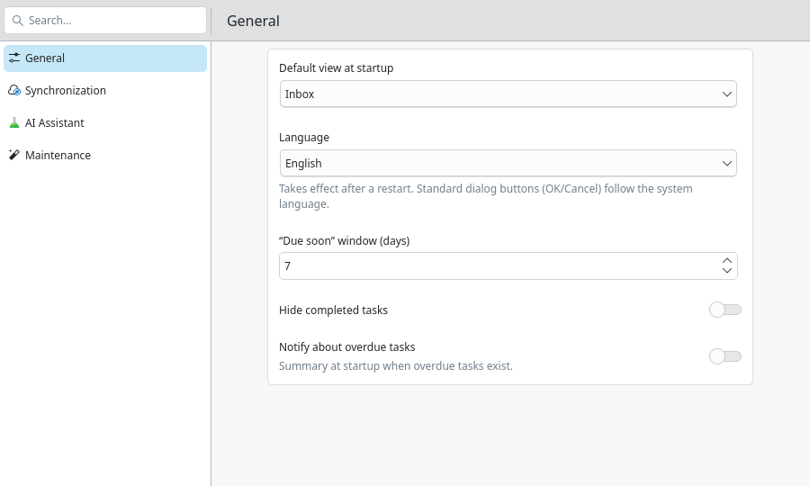
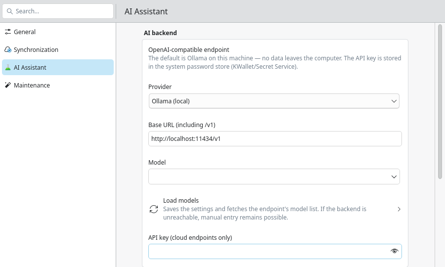
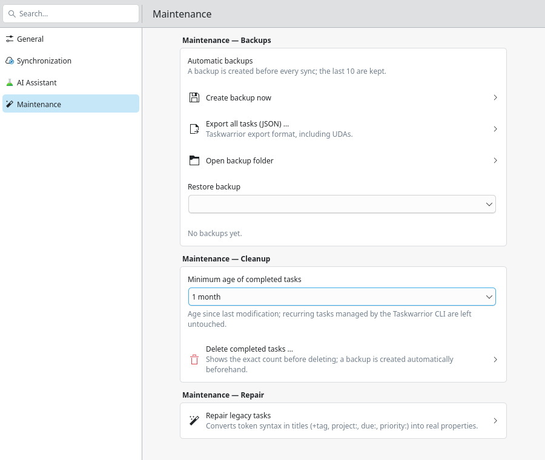

# Vergissmeinnicht (KDE)

[](https://github.com/hnsstrk/vergissmeinnicht-kde/actions/workflows/ci.yml)
[](https://github.com/hnsstrk/vergissmeinnicht-kde/releases/latest)
[](LICENSE)

A native KDE Plasma client for [Taskwarrior](https://taskwarrior.org) 3.x,
built on [TaskChampion](https://github.com/GothenburgBitFactory/taskchampion).
Kirigami front-end, Rust core via [cxx-qt](https://github.com/KDAB/cxx-qt).

This is the Linux/KDE port of the
[macOS app of the same name](https://github.com/hnsstrk/vergissmeinnicht) —
same Rust core, same replica-plus-sync architecture, native UI on each
platform.

> **Vergissmeinnicht** is the German word for *forget-me-not* — a flower, and
> a reminder.

🇩🇪 [Deutsche Version](README.de.md)


## Features

- **Sidebar perspectives** — Inbox · Today · To Do · Overdue · Due Soon ·
  Scheduled · Waiting · All, plus per-project and per-tag rows. Live counts
  of open tasks (recurring masters included, completed excluded); the All
  row shows `open/total`. Drop targets, context menus for rename/remove.
  Dotted projects
  (`Work.Sub`) form a collapsible tree; selecting a parent includes its
  subprojects (Taskwarrior prefix semantics). Resizable via a drag handle,
  sections collapse by clicking their headers; both are persisted.
- **Full-text search with operators** (Ctrl+F) — covers title, project, tags,
  and annotations across the entire store (pending, completed, recurring).
  Supports AND terms, quoted phrases, and `project:`, `tag:`, `status:`
  operators (German and English aliases). While a search is active the
  sidebar filter is ignored. Free-text terms are typo-tolerant: German
  spelling variants are folded (`pruefen` finds `prüfen`, `strasse` finds
  `Straße`) and a small edit distance covers slips such as `prüfem`. Words
  of three letters or less must match exactly, and the operators above stay
  exact.
- **Saved searches** (Ctrl+Shift+D) — name a search and pin it to the sidebar
  between system filters and projects. Right-click to rename or delete.
- **Quick capture** (Ctrl+N) — capture window with title, notes, project,
  tags, due, priority, recurrence. The title field understands terminal-style
  tokens (`+tag project:foo due:tomorrow priority:H`) with a live preview.
  Like the detail editor and the settings, it opens as a separate dialog
  window (movable and resizable), not as a modal inside the main window.
  With a configured AI backend, **Interpret with AI** (Ctrl+J) sends the
  free-form title text to the model and fills the structured fields from the
  validated response — invalid due/recurrence/priority values are dropped,
  new project names are allowed, fields the model leaves empty keep the
  values you entered (the model only replaces what it actually fills), and
  nothing is created until the regular Add button confirms. With a complete
  dictation chain (see AI assistant below) — which is independent of the
  configured model, so dictation works on machines too weak to run one —
  the microphone button next to it records on the first click (the button
  pulses), stops and transcribes on the second, and the transcript lands
  in the title field and automatically continues into the AI
  interpretation. Whatever part of the two strands is not set up shows as
  a disabled button with the reason in its tooltip instead of being
  hidden. Recording and transcription can be discarded at any point;
  errors show up in the dialog's own status area.

  
- **Detail editor** — title, project, tags, due, scheduled, wait, priority,
  recurrence, annotations, dependency editor, reactivate for completed
  tasks.

  
- **Multi-selection** with bulk done / delete / project / tag / priority /
  due / snooze via context menu (Ctrl/Shift+click, Ctrl+A).
- **Drag & drop** tasks onto projects, tags, or Inbox (clears project + tags).
- **Recurring tasks** — daily / weekly / monthly / yearly + `Nd / Nw / Nm /
  Ny`. Completing a recurring task atomically creates the next instance.
- **Snooze / wait** — defer tasks; they appear under "Waiting" instead of
  cluttering Today.
- **Dependencies** — Blocked / Blocking / Unblocked report views
  (`+BLOCKED`/`+BLOCKING`/`+UNBLOCKED` semantics) plus a dependency editor in
  the detail dialog (add/remove `depends` relations with title lookup).
- **Notifications** — opt-in summary at launch when overdue tasks exist
  (freedesktop notifications).
- **Categorized settings** — General, Synchronization, AI assistant and
  Maintenance as separate pages in a settings window with a category
  sidebar.

  
- **AI assistant (opt-in)** — configured under Settings → AI Assistant:
  provider preset (Ollama local by default, OpenRouter, or a custom
  OpenAI-compatible endpoint), the model picked from the endpoint's model
  list (fetched automatically when the page opens; a reachability line
  shows whether the endpoint answered and how many models it offers, and
  "Load models" stays as an explicit refresh — manual entry keeps working
  when the backend is offline; switching the provider or editing the
  base URL discards the stale list and reachability state and quietly
  refetches from the new endpoint — without sending the stored API key,
  which belongs to the saved endpoint), the API key in the Secret
  Service, and
  the speech-to-text backend for dictation — either `openai-whisper` (the
  `whisper` CLI from `PATH`, CPU, model name configurable) or
  `whisper.cpp` (a `whisper-cli` binary plus a GGML model file, both given
  as paths; this is the way to use a GPU build). For `whisper.cpp` the
  binary's own directory is prepended to the child process's
  `LD_LIBRARY_PATH` — ROCm/HIP builds keep `libwhisper.so` next to the
  binary, so the plain binary path works without a wrapper script — and
  the availability probe launches the binary once (`--help`), so a binary
  that cannot resolve its libraries counts as unavailable. Dictation
  additionally needs PipeWire's `pw-record`; if any part of that chain is
  missing, the microphone stays visible but disabled and its tooltip
  names the missing part, instead of failing at record time.
  Recordings and transcripts live in the XDG runtime directory and are
  deleted after use. A context-scope setting controls how much task data the AI
  sees when interpreting input: project and tag names only (default),
  plus open task titles, or all non-deleted tasks compactly — deleted
  tasks are never sent. "Save and test" verifies the connection via the
  model list; a privacy note appears for non-local endpoints.

  

  **Which model to use.** Measured on the reference system (local Ollama,
  Radeon RX 7900 XTX, 64k context), **`gemma4:12b` gave the best results**
  and is the recommendation: ~20 s per interpretation, and across 8 runs it
  mapped every input onto an existing project with a correct due date.
  Reasoning models are markedly worse for this task — `qwen3.6:27b` took
  90–163 s for the same work and left the project field empty in about half
  the runs. Thinking cannot be disabled through the OpenAI-compatible
  endpoint (`think: false` only exists on Ollama's native `/api/chat`, and
  `reasoning_effort` only ever switches it *on*), so the model choice is
  the lever. The request timeout is 300 s to accommodate slow backends.
- **Localization** — German (source) and English via ki18n/gettext, with
  manual override in the settings.
- **Sync** against any [taskchampion-sync-server](https://github.com/GothenburgBitFactory/taskchampion-sync-server)
  you point it at. Credentials live in the system Secret Service (KWallet).
  Auto-sync modes: manual, every 5/15/60 minutes, or immediately after
  changes. The toolbar button indicates unsynchronized local changes with
  a blue dot, and is hidden entirely (`Ctrl+Shift+S` included) until a
  sync server is configured.
- **Automatic backups** — `VACUUM INTO` snapshot before every sync, rotated
  to the last 10. Manual backup and restore from settings. See
  [`docs/backup-and-restore.md`](docs/backup-and-restore.md).
- **Completed-task cleanup** — a maintenance action deletes completed
  tasks older than a chosen age (1 month to 1 year, by last
  modification). The confirmation names the exact count and freezes the
  affected set — never more than confirmed gets deleted, no matter how
  long the dialog stays open. A backup is written automatically first,
  the whole purge is one undo step (Ctrl+Z), and CLI-managed recurrence
  is never touched.

  
- **Taskwarrior parity** — urgency (exact CLI formula) as sort order,
  start/stop (active task), undo (Ctrl+Z), `until` expiry, duplicate,
  JSON export incl. UDAs, virtual tags and `due.before:`/`due.after:`/
  `project.not:` in search, CLI date synonyms (`eow`, `friday`, `23rd`, …)
  and recur synonyms (`weekdays`, `quarterly`, …). CLI recurrence
  templates are respected, never duplicated — coexistence with the
  `task` CLI on a shared sync server is verified end-to-end
  (see `docs/architecture.md`).
- **Legacy repair** — a maintenance action converts token syntax left in
  task titles (`+tag project:x`) into real properties.

*(All screenshots show a seeded demo dataset —
`cargo run --release -p vergissmeinnicht-core --example seed_demo -- <replica-path>`.
Screenshots with AI controls additionally use the demo AI configuration the
same example writes with `--ai-config` — no server or API key involved, see
`docs/building.md`.)*

## Architecture

```
┌─────────────────────────────────────────────┐
│  Kirigami/QML UI (Main window + dialogs)    │
│  Sidebar · TaskList · Detail · Settings     │
└──────────────────┬──────────────────────────┘
                   │  cxx-qt bridge (QAbstractListModel + invokables)
┌──────────────────▼──────────────────────────┐
│  vergissmeinnicht-app (Rust)                │
│  AppState · filters · parsers · backups     │
└──────────────────┬──────────────────────────┘
                   │  plain Rust
┌──────────────────▼──────────────────────────┐
│  vergissmeinnicht-core (Rust)               │
│  taskchampion 3.x · tokio                   │
│  Replica = SQLite under XDG data dir        │
└──────────────────┬──────────────────────────┘
                   │  HTTPS
┌──────────────────▼──────────────────────────┐
│  taskchampion-sync-server (your own)        │
└─────────────────────────────────────────────┘
```

The replica lives in `~/.local/share/vergissmeinnicht/replica/`. The app does
**not** touch the Taskwarrior CLI's own data directory — both are independent
TaskChampion replicas that converge through the same sync server, exactly like
the macOS app and the CLI on other machines.

See [`docs/architecture.md`](docs/architecture.md) for the design rationale
behind the storage layout, the `u32` working-set ID, and the replica
lifecycle.

## Download

Release tarballs (dynamically linked x86_64, built on Arch Linux) are
available on the [releases page](https://github.com/hnsstrk/vergissmeinnicht-kde/releases).
They require Qt 6, Kirigami 6, Kirigami Addons, ki18n, and
qqc2-desktop-style at runtime. On anything that is not a current rolling
release, **building from source is the recommended path** — see below.

## Requirements

- Qt 6 (qt6-base, qt6-declarative)
- KDE Frameworks 6: Kirigami, Kirigami Addons, ki18n, qqc2-desktop-style,
  Breeze icons
- Rust toolchain (stable)
- gettext (`msgfmt`, for the translation catalogs)

On Arch and derivatives:

```sh
pacman -S --needed rust qt6-base qt6-declarative kirigami kirigami-addons \
    ki18n qqc2-desktop-style breeze-icons gettext
```

## Build

```sh
# Build and run the debug build
cargo build
./target/debug/vergissmeinnicht

# Or build + install to ~/.local (binary, desktop file, icon, translations)
scripts/install-local.sh
```

Run the test suite:

```sh
cargo test --workspace
```

See [`docs/building.md`](docs/building.md) for toolchain notes, the QML/bridge
registration rules, and the headless test hooks (`--test-flow`,
`--test-grab`).

## Sync setup

1. Run your own [taskchampion-sync-server](https://github.com/GothenburgBitFactory/taskchampion-sync-server)
   (or use an existing one).
2. In the app, open **Settings → Synchronization** and fill in URL, client ID,
   and the encryption secret. They are stored in the Secret Service
   (KWallet on Plasma).
3. Click **Save and test sync**. Done.

The app and the `task` CLI on other machines reconcile through the sync
server. TaskChampion resolves conflicts CRDT-style via its operation log.

## Project layout

```
.
├── core/               Rust core: taskchampion wrapper (TaskStore, TaskInfo)
│   └── examples/       seed_demo, sync_roundtrip (E2E against a live server)
├── app/                Kirigami app
│   ├── src/            cxx-qt bridge, filters, parsers, state, backups
│   │   └── ai/         opt-in AI assistance (in progress): LLM client,
│   │                   prompt builders, validated drafts, canned-response
│   │                   mock, request worker, dictation (recording +
│   │                   speech-to-text)
│   ├── qml/            Main window, sidebar, dialogs
│   └── cpp/            small shims (KLocalizedContext, window grab)
├── data/               desktop file, icon, AppStream metainfo
├── po/                 gettext template + English catalog
├── scripts/            install-local.sh
└── docs/               architecture notes, building, backup & restore
```

## Hooks: out of scope by design

Taskwarrior hooks are a feature of the `task` CLI, not the TaskChampion
library this app uses. Equivalents (reminders, validation) are implemented
natively — same decision as the macOS app.

## Acknowledgements

- [Taskwarrior](https://taskwarrior.org) and the GothenburgBitFactory team for
  [TaskChampion](https://github.com/GothenburgBitFactory/taskchampion) and the
  sync server.
- [KDAB](https://www.kdab.com) for [cxx-qt](https://github.com/KDAB/cxx-qt).
- The KDE community for Kirigami and the Frameworks.

## License

[MIT](LICENSE).
